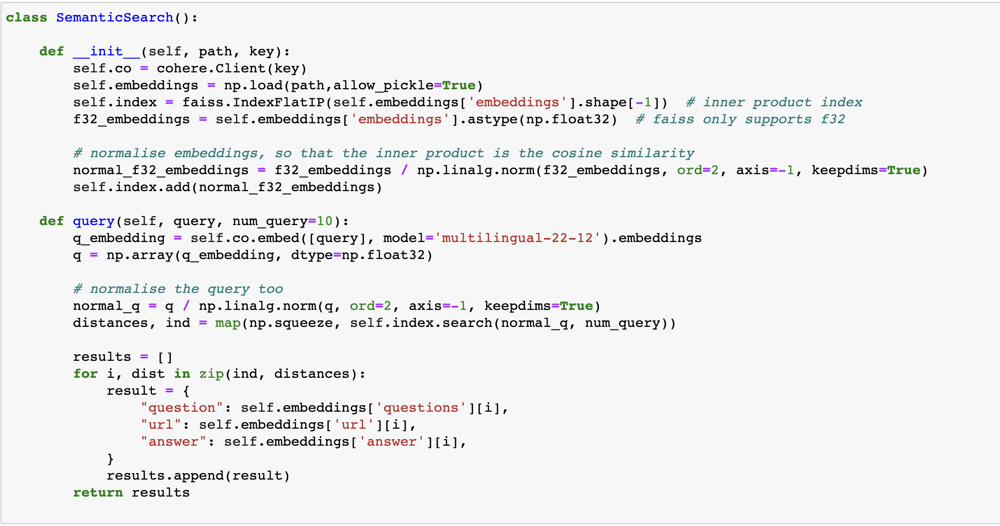
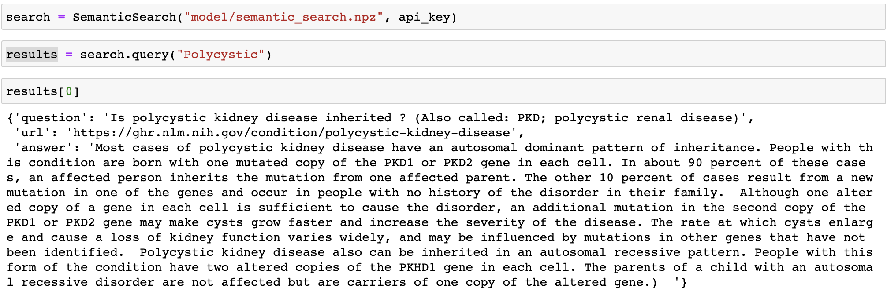

# Semantic Search AI Hackathon

Using Cohere for Semantic Search for a AI Hackaton at [LabLab](https://lablab.ai/)

## [LIVE APP](https://alizahidraja-semantic-search-ai-hackathon-app-umkitt.streamlit.app/)

## [Presentation](https://docs.google.com/presentation/d/1rp6d_tiopwwdljVecH9SmA_PZ1daz-hzdFvp6Lc9gT8/edit#slide=id.p)

## Steps

1. Read the Multilingual Dataset, this is already in correct columns
2. Read the QA dataset, this data needs to be cleaned and seperated into seperate columns
3. Join the cleaned dataset and make the final dataset to be used for training named `finaldf.csv`
4. Train all rows from dataset using multilingual model
5. Visualize
6. For Final Training, train the model again and save it using np.save along with all columns of final dataset
7. For Production, make a class, load the model from file and use it for queries

## Production

This is how the model will be used in production of our stream lit application
### Model Class

### Model Usage

